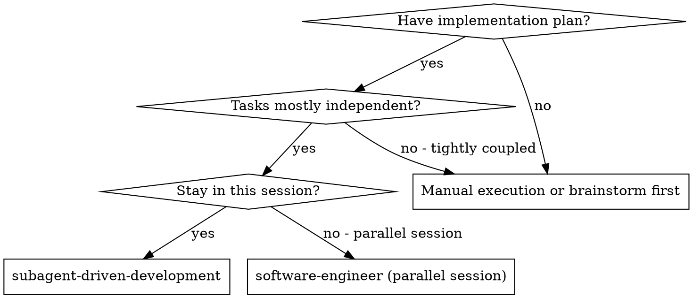
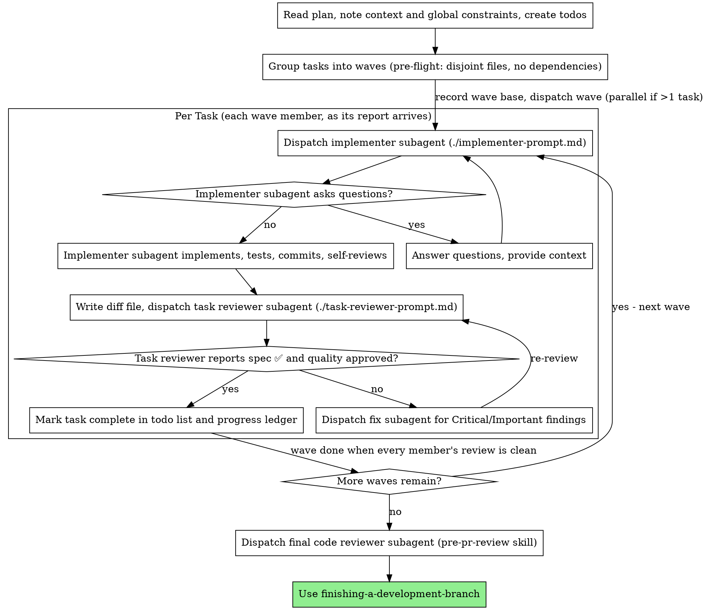

# Subagent-Driven Development

Execute plan by dispatching a fresh implementer subagent per task, a task review (spec compliance + code quality) after each, and a broad whole-branch review at the end.

**Why subagents:** You delegate tasks to specialized agents with isolated context. By precisely crafting their instructions and context, you ensure they stay focused and succeed at their task. They should never inherit your session's context or history — you construct exactly what they need. This also preserves your own context for coordination work.

**Core principle:** Fresh subagent per task + task review (spec + quality) + broad final review = high quality, fast iteration. Tasks whose work provably doesn't collide run as a parallel wave; everything else runs sequentially.

**Narration:** between tool calls, narrate at most one short line — the
ledger and the tool results carry the record.

**Continuous execution:** Do not pause to check in with your human partner between tasks. Execute all tasks from the plan without stopping. The only reasons to stop are: BLOCKED status you cannot resolve, ambiguity that genuinely prevents progress, or all tasks complete. "Should I continue?" prompts and progress summaries waste their time — they asked you to execute the plan, so execute it.

## When to Use

**vs. Executing Plans (parallel session):**
- Same session (no context switch)
- Fresh subagent per task (no context pollution)
- Review after each task (spec compliance + code quality), broad review at the end
- Faster iteration (no human-in-loop between tasks)

## The Process

A wave with one task is exactly the sequential flow. A wave with several
dispatches all its implementers in a single message and runs the per-task
loop for each member as its report arrives — see Parallel Waves below.

## Pre-Flight Plan Review

Before dispatching Task 1, scan the plan once for conflicts:

- tasks that contradict each other or the plan's Global Constraints
- anything the plan explicitly mandates that the review rubric treats as a
  defect (a test that asserts nothing, verbatim duplication of a logic block)

Present everything you find to your human partner as one batched question —
each finding beside the plan text that mandates it, asking which governs —
before execution begins, not one interrupt per discovery mid-plan. If the
scan is clean, proceed without comment. The review loop remains the net for
conflicts that only emerge from implementation.

In the same pass, plan the waves. For each task, list the files the plan
says it creates or modifies (including tests), and draw a dependency edge
when a task consumes an interface, type, or artifact another task produces,
or the plan orders them explicitly. Two tasks may share a wave only when
ALL of these hold:

- neither depends on the other, directly or transitively
- their predicted file sets are disjoint — counting test files, fixtures,
  migrations, and shared registries (a package manifest, a route table, an
  exports barrel, a lockfile is a file both tasks touch)
- they don't compete for a resource outside git: the same dev-server port,
  the same database, the same code-generation step

Disjointness must be provable from the plan's text. If the plan doesn't
name a task's files precisely enough to prove it, that task runs alone —
sequential is the default; parallel must be earned. Write the wave plan
(wave number → task numbers → each task's file list) into the progress
ledger before dispatching Wave 1.

## Parallel Waves

Tasks grouped into the same wave run as concurrent implementer subagents in
the same working tree, committing to the same branch. Mechanics:

- Record the wave base once (`git rev-parse HEAD`) before dispatching.
  Every task in the wave shares this BASE.
- Dispatch all the wave's implementers in a single message (multiple Agent
  calls in one block). Each dispatch carries its own brief and report
  paths, plus — because siblings share the tree — the File Boundary block
  from implementer-prompt.md naming exactly the files that task may touch.
- Interleaved commits on the branch are expected. Generate each task's
  review package scoped to its files:
  `scripts/review-package WAVE_BASE HEAD -- <task's files>` — the pathspec
  keeps sibling commits and hunks out of this task's review.
- Handle each implementer's report as it arrives: boundary check, review
  package, task reviewer. Wave siblings' reviews may also run in parallel,
  and fix subagents inherit the same file boundary as their task.
- **Boundary check before review:** `git show --stat` each commit the
  implementer reports; every file must be inside the task's declared list.
  A strayed commit is a collision — warn the reviewers of every affected
  task that their diffs may contain foreign hunks, and run whatever those
  tasks still need (fixes, re-reviews) sequentially.
- One member reporting BLOCKED or NEEDS_CONTEXT does not stop its
  siblings. Resolve it per Handling Implementer Status; the task re-runs
  solo or joins a later wave once unblocked.
- A wave is complete only when every member's review is clean. Do not
  start the next wave early — its tasks may depend on this wave's
  interfaces.

## Model Selection

Use the least powerful model that can handle each role to conserve cost and increase speed.

**Mechanical implementation tasks** (isolated functions, clear specs, 1-2 files): use a fast, cheap model. Most implementation tasks are mechanical when the plan is well-specified.

**Integration and judgment tasks** (multi-file coordination, pattern matching, debugging): use a standard model.

**Architecture and design tasks**: use the most capable available model.
The final whole-branch review is one of these — dispatch it on the most
capable available model, not the session default.

**Review tasks**: choose the model with the same judgment, scaled to the
diff's size, complexity, and risk. A small mechanical diff does not need the
most capable model; a subtle concurrency change does.

**Always specify the model explicitly when dispatching a subagent.** An
omitted model inherits your session's model — often the most capable and
most expensive — which silently defeats this section.

**Turn count beats token price.** Wall-clock and context cost scale with how
many turns a subagent takes, and the cheapest models routinely take 2-3× the
turns on multi-step work — costing more overall. Use a mid-tier model as the
floor for reviewers and for implementers working from prose descriptions.
When the task's plan text contains the complete code to write, the
implementation is transcription plus testing: use the cheapest tier for
that implementer. Single-file mechanical fixes also take the cheapest tier.

**Task complexity signals (implementation tasks):**
- Touches 1-2 files with a complete spec → cheap model
- Touches multiple files with integration concerns → standard model
- Requires design judgment or broad codebase understanding → most capable model

**Real budget enforcement lives in Workflows, not here.** This skill's cost
control is pre-flight judgment — pick the cheapest model that fits each role —
because a skill-dispatched subagent cannot read live token spend. When you need
an actual accumulating budget (a hard token ceiling, or a spend-aware
loop-until-budget), run the work as a Workflow instead: its `budget.spent()` /
`budget.remaining()` meter the shared token pool in real time. Reach for that
when a run's cost must be bounded by a number, not a heuristic.

## Handling Implementer Status

Implementer subagents report one of four statuses. Handle each appropriately:

**DONE:** Generate the review package (`scripts/review-package BASE HEAD`, from this skill's directory — it prints the unique file path it wrote; BASE is the commit you recorded before dispatching the implementer — never `HEAD~1`, which silently drops all but the last commit of a multi-commit task), then dispatch the task reviewer with the printed path.

**DONE_WITH_CONCERNS:** The implementer completed the work but flagged doubts. Read the concerns before proceeding. If the concerns are about correctness or scope, address them before review. If they're observations (e.g., "this file is getting large"), note them and proceed to review.

**NEEDS_CONTEXT:** The implementer needs information that wasn't provided. Provide the missing context and re-dispatch.

**BLOCKED:** The implementer cannot complete the task. Assess the blocker:
1. If it's a context problem, provide more context and re-dispatch with the same model
2. If the task requires more reasoning, re-dispatch with a more capable model
3. If the task is too large, break it into smaller pieces
4. If the plan itself is wrong, escalate to the human

**Never** ignore an escalation or force the same model to retry without changes. If the implementer said it's stuck, something needs to change.

## Retry Budget and Failure Class

Cap re-dispatches so a stuck task escalates instead of looping. Each task gets
at most **two** re-dispatch attempts (three tries total) before the controller
must stop and escalate to the human — controllers that lost their place have
burned whole sessions re-dispatching the same failing task. Record each attempt
in the progress ledger so the count survives compaction.

Before re-dispatching, classify the failure — retry only the classes a changed
dispatch can actually fix:

- **Transient or contextual** (missing context, wrong model tier, task sliced
  too large): retryable. Re-dispatch with the specific change — more context, a
  stronger model, a smaller slice — never the same dispatch again.
- **Structural** (the plan is wrong, the task contradicts another task, an
  interface it needs was never built, the task is impossible as written): not
  retryable. Stop and escalate to the human with the specific reason; a retry
  cannot fix a bad plan. Same rule the pre-flight review and reviewer loop
  already follow — a plan contradiction is the human's decision.

A failure that exhausts the retry budget is treated as structural: escalate.

### Downstream Invalidation

When a task fails or changes what it produces — it couldn't build the interface
a later wave was promised, or built it differently — the tasks that depend on it
are now briefed against a contract that no longer holds. Do not dispatch them
as-is. Mark each dependent task in the ledger as needing re-brief, and re-derive
its brief from the interface that was actually produced before it runs. If the
change is a real scope change and not just a signature tweak, it is a plan
contradiction: present it and the plan text to the human and ask which governs,
exactly as the pre-flight review does. This is the only "adapt the remaining
plan" move the skill makes — always human-gated for real scope changes, never
an autonomous re-plan.

## Handling Reviewer ⚠️ Items

The task reviewer may report "⚠️ Cannot verify from diff" items — requirements
that live in unchanged code or span tasks. These do not block the rest of the
review, but you must resolve each one yourself before marking the task
complete: you hold the plan and cross-task context the reviewer
lacks. If you confirm an item is a real gap, treat it as a failed spec
review — send it back to the implementer and re-review.

## Constructing Reviewer Prompts

Per-task reviews are task-scoped gates. The broad review happens once, at the
final whole-branch review. When you fill a reviewer template:

- Do not add open-ended directives like "check all uses" or "run race tests
  if useful" without a concrete, task-specific reason
- Do not ask a reviewer to re-run tests the implementer already ran on the
  same code — the implementer's report carries the test evidence
- Do not pre-judge findings for the reviewer — never instruct a reviewer to
  ignore or not flag a specific issue. If you believe a finding would be a
  false positive, let the reviewer raise it and adjudicate it in the review
  loop. If the prompt you are writing contains "do not flag," "don't treat X
  as a defect," "at most Minor," or "the plan chose" — stop: you are
  pre-judging, usually to spare yourself a review loop.
- The global-constraints block you hand the reviewer is its attention
  lens. Copy the binding requirements verbatim from the plan's Global
  Constraints section or the spec: exact values, exact formats, and the
  stated relationships between components ("same layout as X", "matches
  Y"). The reviewer's template already carries the process rules (YAGNI,
  test hygiene, review method) — the constraints block is for what THIS
  project's spec demands.
- Hand the reviewer its diff as a file: run this skill's
  `scripts/review-package BASE HEAD` and pass the reviewer the file path
  it prints (or, without bash: `git log --oneline`, `git diff --stat`,
  and `git diff -U10` for the range, redirected to one uniquely named
  file). The output never enters your own context, and the reviewer sees
  the commit list, stat summary, and full diff with context in one Read
  call. Use the BASE you recorded before dispatching the implementer —
  never `HEAD~1`, which silently truncates multi-commit tasks. For a task
  that ran in a parallel wave, scope the package to the task's files:
  `scripts/review-package WAVE_BASE HEAD -- <task's files>` — an unscoped
  range would hand the reviewer its siblings' work as part of the diff.
- A dispatch prompt describes one task, not the session's history. Do not
  paste accumulated prior-task summaries ("state after Tasks 1-3") into
  later dispatches — a real session's dispatch hit 42k chars of which 99%
  was pasted history. A fresh subagent needs its task, the interfaces it
  touches, and the global constraints. Nothing else.
- Dispatch fix subagents for Critical and Important findings. Record Minor
  findings in the progress ledger as you go, and point the final
  whole-branch review at that list so it can triage which must be fixed
  before merge. A roll-up nobody reads is a silent discard.
- A finding labeled plan-mandated — or any finding that conflicts with
  what the plan's text requires — is the human's decision, like any plan
  contradiction: present the finding and the plan text, ask which governs.
  Do not dismiss the finding because the plan mandates it, and do not
  dispatch a fix that contradicts the plan without asking.
- The final whole-branch review gets a package too: run
  `scripts/review-package MERGE_BASE HEAD` (MERGE_BASE = the commit the
  branch started from, e.g. `git merge-base main HEAD`) and include the
  printed path in the final review dispatch, so the final reviewer reads
  one file instead of re-deriving the branch diff with git commands.
- Every fix dispatch carries the implementer contract: the fix subagent
  re-runs the tests covering its change and reports the results. Name the
  covering test files in the dispatch — a one-line fix does not need the
  whole suite. Before re-dispatching the reviewer, confirm the fix report
  contains the covering tests, the command run, and the output; dispatch
  the re-review once all three are present.
- If the final whole-branch review returns findings, dispatch ONE fix
  subagent with the complete findings list — not one fixer per finding.
  Per-finding fixers each rebuild context and re-run suites; a real
  session's final-review fix wave cost more than all its tasks combined.

## File Handoffs

Everything you paste into a dispatch prompt — and everything a subagent
prints back — stays resident in your context for the rest of the session
and is re-read on every later turn. Hand artifacts over as files:

- **Task brief:** before dispatching an implementer, run this skill's
  `scripts/task-brief PLAN_FILE N` — it extracts the task's full text to a
  uniquely named file and prints the path. Compose the dispatch so the
  brief stays the single source of requirements. Your dispatch should
  contain: (1) one line on where this task fits in the project; (2) the
  brief path, introduced as "read this first — it is your requirements,
  with the exact values to use verbatim"; (3) interfaces and decisions
  from earlier tasks that the brief cannot know; (4) your resolution of
  any ambiguity you noticed in the brief; (5) the report-file path and
  report contract. Exact values (numbers, magic strings, signatures, test
  cases) appear only in the brief.
- **Report file:** name the implementer's report file after the brief
  (brief `…/task-N-brief.md` → report `…/task-N-report.md`) and put it in
  the dispatch prompt. The implementer writes the full report there and
  returns only status, commits, a one-line test summary, and concerns.
- **Reviewer inputs:** the task reviewer gets three paths — the same brief
  file, the report file, and the review package — plus the global
  constraints that bind the task.
- Fix dispatches append their fix report (with test results) to the same
  report file and return a short summary; re-reviews read the updated file.

## Durable Progress

Conversation memory does not survive compaction. In real sessions,
controllers that lost their place have re-dispatched entire completed task
sequences — the single most expensive failure observed. Track progress in
a ledger file, not only in todos.

- At skill start, check for a ledger:
  `cat "$(git rev-parse --show-toplevel)/.superpowers/sdd/progress.md"`. Tasks listed there
  as complete are DONE — do not re-dispatch them; resume at the first task
  not marked complete. If the ledger holds a wave plan, resume mid-wave:
  re-dispatch only the wave members not marked complete.
- The wave plan (wave → tasks → file lists) lives in the ledger too,
  written during pre-flight — after compaction it is the only record of
  which tasks were cleared to run together and what files each may touch.
- When a task's review comes back clean, append one line to the ledger in
  the same message as your other bookkeeping:
  `Task N: complete (commits <base7>..<head7>, review clean)`.
- Record the run's quality when it ends: **clean** if every task passed with no
  re-dispatch, **degraded** if any task needed a retry or landed with a recorded
  concession, **failed** if any task escalated to the human unresolved. Each
  term has a mechanical trigger — any re-dispatch means at least degraded, any
  unresolved escalation means failed — so the final review and any standup get a
  truthful signal instead of a guess.
- The ledger is your recovery map: the commits it names exist in git even
  when your context no longer remembers creating them. After compaction,
  trust the ledger and `git log` over your own recollection.
- `git clean -fdx` will destroy the ledger (it's git-ignored scratch); if
  that happens, recover from `git log`.

## Prompt Templates

- [implementer-prompt.md](implementer-prompt.md) - Dispatch implementer subagent
- [task-reviewer-prompt.md](task-reviewer-prompt.md) - Dispatch task reviewer subagent (spec compliance + code quality)
- Final whole-branch review: use the pre-pr-review skill
- [example-workflow.md](example-workflow.md) - Worked end-to-end example (illustrative, not normative)

## Red Flags

**Never:**
- Start implementation on main/master branch without explicit user consent
- Skip task review, or accept a report missing either verdict (spec compliance AND task quality are both required)
- Proceed with unfixed issues
- Dispatch implementers in parallel without a pre-flight wave plan proving
  their file sets disjoint — overlap, an unproven file list, or a
  dependency between them means sequential
- Dispatch a wave implementer without the File Boundary block, or accept a
  wave commit staged with `git add -A` / `git add .` / `git commit -a`
- Start the next wave while any current-wave member has an open review
- Make a subagent read the whole plan file (hand it its task brief —
  `scripts/task-brief` — instead)
- Skip scene-setting context (subagent needs to understand where task fits)
- Ignore subagent questions (answer before letting them proceed)
- Accept "close enough" on spec compliance (reviewer found spec issues = not done)
- Skip review loops (reviewer found issues = implementer fixes = review again)
- Let implementer self-review replace actual review (both are needed)
- Tell a reviewer what not to flag, or pre-rate a finding's severity in the
  dispatch prompt ("treat it as Minor at most") — the plan's example code is
  a starting point, not evidence that its weaknesses were chosen
- Dispatch a task reviewer without a diff file — generate it first
  (`scripts/review-package BASE HEAD`) and name the printed path in the
  prompt
- Move to next task while the review has open Critical/Important issues
- Re-dispatch a task the progress ledger already marks complete — check
  the ledger (and `git log`) after any compaction or resume
- Fix a failed task yourself instead of dispatching a fix subagent — manual
  fixes pollute your controller context (see Handling Implementer Status)

## Integration

**Required workflow skills:**
- **using-git-worktrees** - Ensures isolated workspace (creates one or verifies existing)
- **writing-plans** - Creates the plan this skill executes
- **pre-pr-review** - Strict pre-PR review for the final whole-branch check
- **finishing-a-development-branch** - Complete development after all tasks

**Subagents should use:**
- **software-engineer** - Subagents follow this build loop (test-first + verify) for each task
